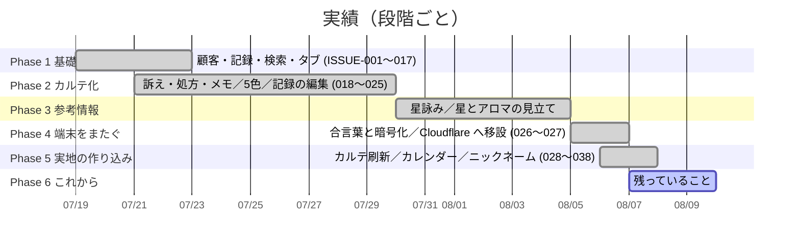

# 02_作業計画書 (WBS): Terre Mer KARTE

> **改訂 v2.0（2026-08-07）**
> v1.0 は7日ぶんの初期構築計画だった。実際には、**サロンが使いながら決めていく**進め方になり、
> 記録は ISSUE 単位（現在 038 まで）で積み上がっている。
> 本書は、その実績を段階（Phase）として整理し直し、**いま残っていること**を示す。

## 1. 進め方

作りきってから渡す形は採っていない。**出す → 実際に使う → 出てきた要望を次に入れる**を短く回している。

そのため計画は、日付の入ったガントではなく、**段階と、その段階で決まったこと**として持つ。
1件ごとの経緯は `08_Incidents/ISSUE-*.md`、実装の詳細は `03_Implementation/REPORT-ISSUE-*.md` にある。

## 2. 段階ごとの中身

### ■ Phase 1: 基礎（ISSUE-001〜017）
- 顧客の登録・検索・一覧、詳細のタブ切替
- カレンダー、スマホ幅でのレイアウト是正
- **この段階の主な学び**: `aspect-ratio` が min/max 制約を軸間に転写するため、カレンダーが横に溢れていた（ISSUE-017）

### ■ Phase 2: カルテ化（ISSUE-018〜025）
- 訴え・処方・メモを記録に追加。**未記入でも項目名は必ず出す**方針を確立（ISSUE-019）
- Soul Color を最大5色へ
- 記録の後追い編集、入力動線をカレンダーに一本化
- localStorage を try-catch で保護し、遮断時もメモリで動かす（ISSUE-025）

### ■ Phase 3: 参考情報
- 星詠みメッセージを**事前生成＋ファイル配布**に。閲覧では AI を呼ばない
- 星とアロマの見立て表（陰陽・三区分・五行、五臓六腑、精油の安全性）
- **数の合わないところは、合わないまま載せる**方針

### ■ Phase 4: 端末をまたぐ（ISSUE-026〜027）
- OneDrive／フォルダ同期を試し、**どちらもサロンの前提を満たせないと確認**したうえで不採用
- 合言葉ひとつの置き場を新設。PBKDF2 の前半後半を鍵と照合値に使い分け
- Vercel Hobby の規約（個人・非商用／予告なく停止）を理由に **Cloudflare Pages + R2 へ移設**
- 設定画面の整理、顧客No. の固定

### ■ Phase 5: 実地の作り込み（ISSUE-028〜038）
- カルテ刷新（Terre Mer KARTE、初診6項目、時間帯、施術内容、🌸🧪🐬）
- カレンダーに名前の札、ニックネーム優先、押し分けの整理
- ホーム画面のアイコン
- **この段階で、作業中に見つかったことを独立した記録にする運用を開始**（ISSUE-033〜036）

### ■ Phase 6: これから
下表「3. いま残っていること」を参照。

## 3. いま残っていること

| ID | 内容 | 状態 | 判断 |
|:---|:---|:---|:---|
| ISSUE-035 | 定義に無い色キーを渡すと色が消える | **未修正（既知）** | 実データでは起きない。`getSoulColorCssValue` は色表示すべてが通る場所で、影響範囲が広いため触らない |
| ISSUE-029 申し送り | スマホの1マス41pxに長い名前が入らない | 対応済み（姓・ニックネーム表示） | フルネームは一覧と吹き出しに出る。これ以上は幅の制約 |
| ISSUE-026 限界 | 合言葉紛失／端末譲渡／削除が伝わらない | 仕様として受容 | 要件定義 8. に明記 |
| — | 別バックアップ（OneDrive / Google Drive） | **未着手** | Phase 4 で同期の仕組みを削除済みのため、作り直しになる |
| — | CI | **無い** | `.gitlab-ci.yml` が無く `npm test` は `exit 1`。現状はヘッドレスブラウザの実測で代替 |
| — | GitHub | **利用停止中** | 異議申し立て済み・返答待ち。GitLab で開発と配信を継続 |

## 4. 検証のやり方（重要）

**レイアウトの検証は、本物の `product/index.html` を実際の幅で行う。**

`python3 -m http.server` で配信し、Playwright で 390px / 360px / 1280px を測る。

> かつてプレビュー用の1ファイル版で検証していたが、そこには `<meta name="viewport">` が無く、
> スマホとして開いても **CSS 上は980px幅**だった。つまりスマホ向けの調整が一度も効いていない状態で
> 「390pxで確認した」と報告していた（ISSUE-034）。

プレビュー版は、文言・データの出し入れ・押したときの動きの確認には引き続き使う。

## 5. 記録の付け方

- **要望から始まったもの** … 症状 / 根本原因 / 解決策 / 検証結果
- **作業中に見つかったもの** … 上に加えて**どうやって見つかったか**
- **直していないもの** … 状態を「未修正」とし、**なぜいま直さないか**
- **こちらの誤りだったもの** … 消さずに誤診として残す（例: ISSUE-036）

一覧は `08_Incidents/README.md`。

## 6. リスク

| リスク | 現状 |
|---|---|
| 合言葉の紛失 = 全損 | 復旧手段は無い。画面と文書の両方に明記済み |
| 削除が同期で伝わらない | 既知。片方で消すともう片方から戻る |
| CI が無く、退行に気付けない | 変更のたびに手元で回帰スクリプトを流している。仕組み化は未着手 |
| GitHub の停止 | GitLab で代替できている。配信も GitLab 経由 |
| `ui.js` が9,700行 | 分割の予定は立てていない。編集は前後の文字列を固定して行う（添字計算で584行を誤削除した事故あり・ISSUE-028） |
